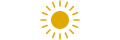

<picture>
  <source media="(prefers-color-scheme: dark)" srcset="hero-dark.svg">
  
</picture>

 

I build things that see, decide and respond: neural networks that read sign language, controllers that talk to sensors, and interfaces people actually enjoy using. Final-year Smart Technology student at Astana IT University. In between commits I run my own coffee shop, Rumaks, which is where most of my ideas get tested on real people.

 

### What I work on

<table>
<tr>
<td width="25%" valign="top"><b>Models</b> Machine learning, deep reinforcement learning, computer vision</td>
<td width="25%" valign="top"><b>Machines</b> Embedded systems, IIoT, networking (Cisco, Huawei ICT)</td>
<td width="25%" valign="top"><b>Interfaces</b> Frontend, UX and UI design, product thinking</td>
<td width="25%" valign="top"><b>Real life</b> Running a coffee shop and building its software myself</td>
</tr>
</table>

### Selected projects

| Project | What it does |
| :-- | :-- |
| [**XZT-IIoT**](https://github.com/Mkirik1/xzt-iiot) | Explainable zero-trust access control with adversarial validation for industrial IoT, paper submitted to IEEE BSS 2026 |
| [**Rumaks menu**](https://github.com/Mkirik1/menu) | Digital menu running in my coffee shop every day |
| [**Rumaks kassa**](https://github.com/Mkirik1/kassa) | Barista shift and register system built for the same coffee shop |
| **Sign language recognition** | Computer vision model for Russian Sign Language, built for deaf and hard of hearing people. In progress |

### Tools I reach for

### Activity

<picture>
  <source media="(prefers-color-scheme: dark)" srcset="https://github-readme-stats.vercel.app/api?username=Mkirik1&show_icons=true&hide_border=true&bg_color=05293A&title_color=FEC50C&icon_color=FEC50C&text_color=F3F7F9&hide_rank=true">
  
</picture>
<picture>
  <source media="(prefers-color-scheme: dark)" srcset="https://github-readme-stats.vercel.app/api/top-langs/?username=Mkirik1&layout=compact&hide_border=true&bg_color=05293A&title_color=FEC50C&text_color=F3F7F9">
  
</picture>

### Say hello

Open to research collaborations, internships and interesting hardware. The fastest way to reach me is through [my GitHub](https://github.com/Mkirik1).

 

  <picture>
    <source media="(prefers-color-scheme: dark)" srcset="sun-dark.svg">
    
  </picture>

